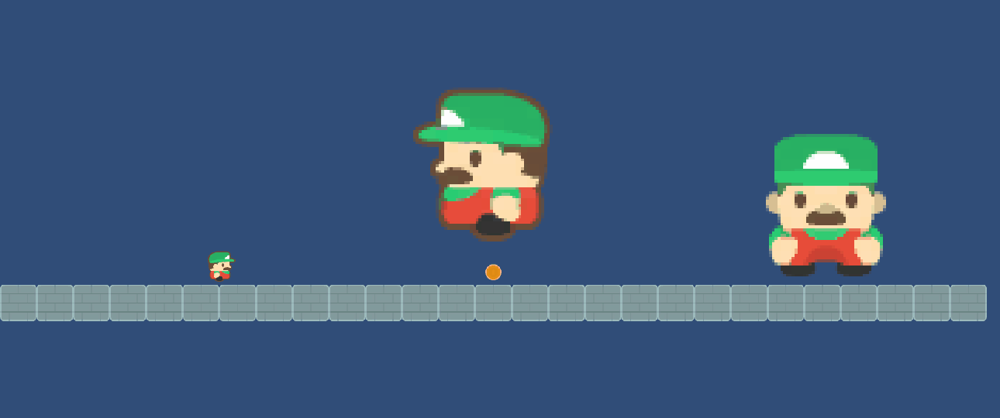

# Práctica FDV Sprites #

## Actividades a realizar:

### 1.Obtener assets que incorpores a tu proyecto: Sprites individuales y Atlas de Sprites.

### 2.Incorporar los recursos del punto 1 en el proyecto y generar al menos 2 animaciones para uno de los personajes.

### 3.Busca en el inspector de objetos la propiedad Flip y comprueba qué pasa al activarla desactivarla en alguno de los ejes.

### 4.Mover uno de los personajes con el eje horizontal virtual que definen las teclas de flechas.

### 5.Hacer saltar el personaje y cambiar de dirección cuando se pulsa la barra espaciadora.

### 6.Crear una animación para otro personaje, que se active cuando el jugador pulse la tecla x.

### 7.Agregar un objeto que al estar el personaje a una distancia menor que un umbral se active una animación, por ejemplo explosión o cualquier otra que venga en el atlas de sprites.